# quadrotor_model
C++ Quadrotor Model

The purpose of this repository is to provide a quadrotor model, implemented in c++.

The objective of the model is that given a state of the quadrotor and an action, to calculate the evolution of the state. For this purpose, the state, actuation and dynamics of the system must be defined.

The code flow is the following:
1. The system parameters are initialized, and the physical constants of the quadrotor are defined.
1. The main loop is entered where the following is performed:
    1. Quadrotor commands are updated.
    1. The behavior of the quadrotor is simulated during a time interval, updating its state (position, velocity, acceleration, orientation, angular velocity, etc.) based on the previous state and the forces and moments acting on it.
        1. Compute the angular speed reached by the motors based on the desired angular speed and the motor dynamics.
        2. Compute the forces and moments applied by the motors.
        4. Compute the forces and moments applied by external forces.
        5. Compute the acceleration and angular acceleration of the quadrotor.
        6. Compute the new state of the quadrotor.

## Table of Contents  
- [1. Quadrotor State](#1-quadrotor-state)
    - [1.1 Kinematics](#11-kinematics)
    - [1.2 Dynamics](#12-dynamics)
    - [1.3 Actuation](#13-actuation)
- [2. Quadrotor Actuation](#2-quadrotor-actuation)
- [3. Quadrotor Dynamics](#3-quadrotor-dynamics)

## 1. Quadrotor State

Quadrotor is a rigid body, which mass center is the origin of the body frame. 

### 1.1 Kinematics
The state from the point of view of kinematics can be defined as:

* **Position** 
$$ \mathbf{p} = [x, y, z] $$
* **Attitude** 
$$ \mathbf{q} = [\theta_x, \theta_y, \theta_z] = [w, q_1, q_2, q_3] $$
* **Velocity** 
$$ \mathbf{v} = [v_x, v_y, v_z] $$
* **Angular velocity** 
$$ \mathbf{\omega} = [\omega_x, \omega_y, \omega_z] $$
* **Linear acceleration** 
$$ \mathbf{a} = [a_x, a_y, a_z] $$
* **Angular acceleration** 
$$ \mathbf{\alpha} = [\alpha_x, \alpha_y, \alpha_z] $$

### 1.2 Dynamics
The state from the point of view of dynamics can be defined as:

* **Force** 
$$ \mathbf{F} = [F_x, F_y, F_z] $$
* **Torque** 
$$ \mathbf{\tau} = [\tau_x, \tau_y, \tau_z] $$

### 1.3 Actuation
The state from the point of view of actuation can be defined as:

* **Motor angular velocity** 
$$ \mathbf{\omega_m} = [\omega_1, \omega_2, \omega_3, \omega_4] $$

## 2. Quadrotor Actuation

The are several ways to define the actuation of a quadrotor. The lowest level of abstraction is the motor angular velocity, which is the input of the motors.

Some of the most common actuation modes are, from lowest to highest level of abstraction:

* **Motor angular velocity** 
$$ \mathbf{\omega_m} = [\omega_1, \omega_2, \omega_3, \omega_4] $$
* **Acro mode** 
$$ \mathbf{Acro} = [\mathbf{T}, \omega_x, \omega_y, \omega_z] $$
* **Attitude mode** 
$$ \mathbf{Attitude} = [\mathbf{T}, \theta_x, \theta_y, \theta_z] $$
* **Speed mode** 
$$ \mathbf{v} = [v_x, v_y, v_z, \omega_z] $$
* **Position mode** 
$$ \mathbf{p} = [x, y, z, \theta_z] $$

For the purpose of this model, the actuation will be defined motor angular velocity. Usually, flight controllers convert from a higher level of abstraction to this one.

## 3. Quadrotor Dynamics

Given a delta time $\Delta t$, each quadrotor state derivative must be calculated.

$$
\dot{x}
=
\begin{bmatrix}
\dot{x} \\
\dot{q} \\
\dot{v} \\
\dot{\omega}
\end{bmatrix}
=
\begin{bmatrix}
v \\
\frac{1}{2} \cdot \omega \times q \\
\frac{1}{m} \cdot F \\
I^{-1} \cdot \tau
\end{bmatrix}
$$

### 3.1 Motors Angular Velocity Derivative
Each motor can be modeled as a first order system, with a time constant $\tau$, a maximum angular velocity $\omega_{max}$ and a minimum angular velocity $\omega_{min}$:

$$ \frac{d\omega_m}{dt} = \frac{1}{\tau} \cdot (\omega_{m,des} - \omega_m) $$

Where:
- $\omega_{m,des}$ is the desired angular velocity of the motor between $\omega_{min}$ and $\omega_{max}$.
- $\omega_m$ is the angular velocity of the motor.
- $\tau$ is the time constant of the motor dynamics.

### 3.2 Angular Velocity Derivative

Motors angular velocity changes produce a torque on the quadrotor. Also, environment forces and moments produce a torque too. 

The angular momentum of a rigid body is given by the product of the inertia matrix and the angular velocity vector:

$$ L = I \cdot \omega_{B} $$

Where:
- $L$ is the angular momentum of the quadrotor
- $I$ is the inertia matrix of the quadrotor
- $\\omega_{B}$ is the angular velocity of the quadrotor in the body frame

Due to the Coriolis effect (or gyroscopic torque), the angular momentum derivative is:

$$ \frac{dL}{dt} = I \cdot \frac{d\omega}{dt} + \omega_{B} \times (I \cdot \omega_{B}) $$

Also, the angular momentum derivative is equal to the sum of all external moments acting on the rigid body:

$$ \frac{dL}{dt} = I \cdot \frac{d\omega}{dt} =  \sum_{i=1}^{n} \tau_i $$

Where:
- $\tau_i$ is the moment vector produced by the $i$-th external force or moment

Reordering the terms, the angular velocity derivative can be calculated as:

$$ \frac{d\omega}{dt} = I^{-1} \cdot [\sum_{i=1}^{n} \tau_i - \omega_{B} \times (I \cdot \omega_{B})] $$

The sum of all external moments is the sum of the moments produced by the motors, the one produced by the aerodynamic moments and the stochastic moments:
<!-- and the gyroscopic moment or the Coriolis moment -->

$$ \sum_{i=1}^{n} \tau_i = \sum_{i=1}^{n} \tau_{i,motor} + \tau_{aero} + \tau_{stochastic} $$

Where:
- $\tau_{i,motor}$ is the moment produced by the $i$-th motor
- $\tau_{aero}$ is the aerodynamic moment
- $\tau_{stochastic}$ is the stochastic moment
<!-- - $\tau_{coriolis}$ is the Coriolis moment -->

**Moment Produced by the Motors**

The moment produced by each motor is composed of two parts, one due to the thrust force and another due to the torque produced by the motor:

$$ \tau_{i} = \tau_{i,thrust} + \tau_{i,torque} $$

Where:
- $\tau_{i,thrust}$ is the moment produced by the thrust force of the $i$-th motor
- $\tau_{i,torque}$ is the moment produced by the torque of the $i$-th motor

The moment produced by the thrust force is given by the cross product between the position of the motor and the thrust force:

$$ \tau_{i,thrust} = \mathbf{r}_i \times \mathbf{F}_i   $$

Where:
- $\mathbf{r}_i$ is the position of the $i$-th motor
- $\mathbf{F}_i$ is the thrust force of the $i$-th motor

Also, the thrust force of each motor depends on the angular velocity of the motor:

$$ \mathbf{F}_i = k_f \cdot \omega_i^2 $$

where:
- $\mathbf{F}_i$ is the force produced by the motor in the z axis of motor frame.
- $k_f$ is the thrust coefficient of the motor.
- $\omega_i$ is the angular speed of the motor.

The moment produced by each motor torque in motor frame is given by the one generated by the motor rotation and the inertia of the motor:

$$ \tau_{i,torque} = \tau_{i,motor} + \tau_{i,inertia}  $$

Where:
- $\tau_{i,motor}$ is the moment produced by the motor rotation
- $\tau_{i,inertia}$ is the moment produced by the inertia of the motor

The moment produced by the motor rotation in motor frame is given by the motor torque coefficient:

$$ \tau_{i,motor} = k_t \cdot \omega_i^2 $$

Where:
- $k_t$ is the torque coefficient of the motor.
- $\omega_i$ is the angular speed of the motor.

The moment produced by the inertia of the motor in motor frame is given by the product of the motor rotational inertia and the angular acceleration of the motor:

$$ \tau_{i,inertia} = J_{i,motor} \cdot \dot{\omega}_i $$

Where:
- $J_{i,motor}$ is the rotational inertia of the motor.
- $\dot{\omega}_i$ is the angular acceleration of the motor.

In resumen, the moment produced by each motor torque in motor frame is given by:

$$ \tau_{i,torque} = k_t \cdot \omega_i^2 + J_{i,motor} \cdot \dot{\omega}_i $$

Rotating the motor frame to the quadrotor frame, the moment produced by each motor torque in quadrotor frame is given by:

$$ \tau_{i,torque} = \mathbf{r}_i \times [k_t \cdot \omega_i^2 + J_{i,motor} \cdot \dot{\omega}_i] $$

Finally, the moment produced by each motor torque in quadrotor frame is given by:

$$ \tau_{i,torque} = \mathbf{r}_i \times [k_f \cdot \omega_i^2 + k_t \cdot \omega_i^2 + J_{i,motor} \cdot \dot{\omega}_i] $$

Where:
- $\mathbf{r}_i$ is the position of the $i$-th motor

Using the following scheme of a quadrotor to simplify equations, the forces applied to it by the rotors can be calculated:

Been *kf* the thrust coefficient and *kt* the torque coefficient, the force and torque applied by each motor can be calculated as:

* Force:

$$ F_m = [F_1, F_2, F_3, F_4] = k_f \cdot [\omega_1^2, \omega_2^2, \omega_3^2, \omega_4^2] $$

* Torque:

$$ \tau_m = [ \tau_1, \tau_2, \tau_3, \tau_4 ] = k_t \cdot [ \omega_1^2, \omega_2^2, \omega_3^2, \omega_4^2 ] + J \cdot [ \dot{\omega}_1, \dot{\omega}_2, \dot{\omega}_3, \dot{\omega}_4 ] $$

Therefore, the total torque applied to the quadrotor by the rotors can be calculated as:

$$
\begin{bmatrix} 
\tau_x \\ \tau_y \\ \tau_z 
\end{bmatrix}
=
\begin{bmatrix}
0 & d_y \cdot k_f & 0 & -d_y \cdot k_f \\
-d_x \cdot k_f & 0 & d_x \cdot k_f & 0 \\
0 & 0 & 0 & 0
\end{bmatrix}
\cdot
\begin{bmatrix}
\omega_1^2 \\ \omega_2^2 \\ \omega_3^2 \\ \omega_4^2
\end{bmatrix}
+
\begin{bmatrix}
0 & 0 & 0 & 0 \\
0 & 0 & 0 & 0 \\
k_t & -k_t & k_t & -k_t
\end{bmatrix}
\cdot
\begin{bmatrix}
\omega_1^2 \\ \omega_2^2 \\ \omega_3^2 \\ \omega_4^2
\end{bmatrix}
+
\begin{bmatrix}
0 & 0 & 0 & 0 \\
0 & 0 & 0 & 0 \\
J & -J & J & -J
\end{bmatrix}
\cdot
\begin{bmatrix}
\dot{\omega}_1 \\ \dot{\omega}_2 \\ \dot{\omega}_3 \\ \dot{\omega}_4
\end{bmatrix}
$$

**Moment Produced by the Aerodynamics**

The aerodynamic moment is produced by the air resistance to the quadrotor's motion, and it depends on the quadrotor's shape, size, and orientation. The aerodynamic moment can be calculated by:

$$ \tau_{aero} = -\omega \times (I_{aero} \cdot \omega) $$

Where:
- $\tau_{aero}$ is the aerodynamic moment
- $I_{aero}$ is the aerodynamic inertia matrix
- $\omega$ is the angular velocity of the quadrotor

The negative sign in front of the equation indicates that the aerodynamic moment always opposes the quadrotor's motion.

**Moment Produced by the Stochastic Forces**

Stochastic moments are produced by the random forces that act on the vehicle.

**Angular Velocity Derivative**

Therefore, the angular velocity derivative can be calculated as:

$$ \frac{d\omega}{dt} = I^{-1} \cdot [(\sum_{i=1}^{n} \mathbf{r}_i \times [k_f \cdot \omega_i^2 + k_t \cdot \omega_i^2 + J_{i,motor} \cdot \dot{\omega}_i]) -\omega \times (I_{aero} \cdot \omega) + \tau_{stochastic} - \omega_{B} \times (I \cdot \omega_{B})] $$

### Lineal Velocity Derivative

The velocity is calculated using the acceleration:

$$ \dot{\mathbf{v}} = \mathbf{a} $$

Where:
- $\mathbf{a}$ is the acceleration of the quadrotor.

The acceleration is calculated using Newton's second law of motion:

$$ \mathbf{a} = \frac{1}{m} \cdot \mathbf{F} $$

Where:
- $m$ is the mass of the quadrotor.
- $\mathbf{F}$ is the total force applied to the quadrotor.

The total force applied to the quadrotor is the sum of the forces applied to the quadrotor by the rotors and the forces applied to the quadrotor by the environment:

$$ \mathbf{F} = \mathbf{F_{rotors}} + \mathbf{F_{environment}} $$

Where:
- $\mathbf{F_{rotors}}$ is the total force applied to the quadrotor by the rotors.
- $\mathbf{F_{environment}}$ is the total force applied to the quadrotor by the environment.

The total force applied to the quadrotor by the rotors is the sum of the forces applied to the quadrotor by each rotor:

$$ \mathbf{F_{rotors}} = \sum_{i=1}^{4} \mathbf{F_{rotor_i}}  = k_f \cdot \sum_{i=1}^{4} \mathbf{w_{rotor_i}} $$

Where:
- $k_f$ is the thrust coefficient of the rotors.
- $\mathbf{w_{rotor_i}}$ is the angular speed of the rotor i.

The total force applied to the quadrotor by the environment is the sum of the forces applied to the quadrotor by the gravity, the drag force and stochastic forces:

$$ \mathbf{F_{environment}} = \mathbf{F_{gravity}} + \mathbf{F_{drag}} + \mathbf{F_{stochastic}} $$

Where:
- $\mathbf{F_{gravity}}$ is the force applied to the quadrotor by the gravity.
- $\mathbf{F_{drag}}$ is the force applied to the quadrotor by the drag force.
- $\mathbf{F_{stochastic}}$ is the stochastic force applied to the quadrotor.

The force applied to the quadrotor by the gravity is given by the following equation:

$$ \mathbf{F_{gravity}} = - m \cdot g \cdot \mathbf{e_3} $$

Where:
- $m$ is the mass of the quadrotor.
- $g$ is the gravitational acceleration.
- $\mathbf{e_3}$ is the unit vector in the z axis of the world frame.

The drag force is proportional to the square of the vehicle's speed, and is opposite in direction to the velocity vector. The magnitude of the drag force is proportional to the square of the vehicle's speed and to a coefficient of drag that depends on the shape and size of the vehicle, as well as the properties of the fluid through which the vehicle is moving. The mathematical model of the drag force can be expressed as:

$$ \mathbf{F_{drag}} = - \frac{1}{2} \cdot \rho \cdot A \cdot C_D \cdot \mathbf{v}^2 $$

where:
- $\mathbf{F_{drag}}$ is the drag force.
- $\rho$ is the density of the fluid.
- $A$ is the cross-sectional area of the vehicle.
- $C_D$ is the drag coefficient.
- $\mathbf{v}$ is the velocity of the vehicle.

Simplified, the drag force can be expressed as:

$$ \mathbf{F_{drag}} = - k_{drag} \cdot v^2 $$

where:
- $k_{drag}$ is the drag coefficient.

$$ \mathbf{F_{drag}} = - k_{drag} \cdot \mathbf{v} $$

Where:
- $k_{drag}$ is the drag coefficient.
- $\mathbf{v}$ is the velocity of the quadrotor.

The stochastic force applied to the quadrotor is a random force that is applied to the quadrotor to simulate the effects of the environment.

### Attitude Derivative

The attitude is calculated using the angular velocity (quaternion derivative):

$$ \dot{\mathbf{q}} = \frac{1}{2} \cdot \mathbf{q} \times \mathbf{\omega} $$

Where:
- $\mathbf{q}$ is the attitude of the quadrotor.
- $\mathbf{\omega}$ is the angular velocity of the quadrotor.

### Position Derivative

The position is calculated using the velocity:

$$ \dot{\mathbf{p}} = \mathbf{v} $$

Where:
- $\mathbf{v}$ is the velocity of the quadrotor.
