# Quadrotor Model in C++

The purpose of this repository is to provide a quadrotor model, implemented in c++.
For that, the implementation of the quadrotor dynamics, inertial measurement unit (IMU) and flight controller has been done.

## Table of Contents
- [Quadrotor State](#quadrotor-state)
  - [Kinematics](#kinematics)
  - [Dynamics](#dynamics)
  - [Actuation](#actuation)
- [Quadrotor Actuation](#quadrotor-actuation)
- [Quadrotor Dynamics](#quadrotor-dynamics)
  - [Quadrotor Dynamics Table of Contents](#quadrotor-dynamics-table-of-contents)
  - [1. Forces and Moments due to Motors at Motor Frame](#1-forces-and-moments-due-to-motors-at-motor-frame)
  - [2. Forces and Moments due to Motors at Body Frame](#2-forces-and-moments-due-to-motors-at-body-frame)
    - [2.1 Forces](#21-forces)
    - [2.2 Moments](#22-moments)
      - [2.2.1 Moment due to Thrust Force](#221-moment-due-to-thrust-force)
      - [2.2.2 Moment due to Torque](#222-moment-due-to-torque)
        - [2.2.2.1 Moment due to Motor Rotation](#2221-moment-due-to-motor-rotation)
        - [2.2.2.2 Moment due to Motor Inertia](#2222-moment-due-to-motor-inertia)
      - [Summary of Moments](#summary-of-moments)
    - [2.3 Summary of Forces and Moments due to Motors at Body Frame](#23-summary-of-forces-and-moments-due-to-motors-at-body-frame)
  - [3. Forces and Moments due to Environment](#3-forces-and-moments-due-to-environment)
    - [3.1 Forces due to Environment](#31-forces-due-to-environment)
      - [3.1.1 Gravity Force](#311-gravity-force)
      - [3.1.2 Aerodynamic Drag](#312-aerodynamic-drag)
      - [3.1.3 Stochastic Force](#313-stochastic-force)
    - [3.2 Moments due to Environment](#32-moments-due-to-environment)
      - [3.2.1 Aerodynamic Drag](#321-aerodynamic-drag)
      - [3.2.2 Stochastic Moment](#322-stochastic-moment)
- [Quadrotor Kinematics](#quadrotor-kinematics)
  - [Quadrotor Kinematics Table of Contents](#quadrotor-kinematics-table-of-contents)
  - [1. Motors Angular Velocity Derivative](#1-motors-angular-velocity-derivative)
  - [2. Vehicle Angular Velocity Derivative](#2-vehicle-angular-velocity-derivative)
  - [3. Vehicle Linear Velocity Derivative](#3-vehicle-linear-velocity-derivative)
  - [4. Vehicle Orientation Derivative](#4-vehicle-orientation-derivative)
  - [5. Vehicle Position Derivative](#5-vehicle-position-derivative)
- [Quadrotor Flight Controller](#quadrotor-flight-controller)
  - [1. Convert ACRO commands into desired forces](#1-convert-acro-commands-into-desired-forces)
  - [2. Convert ACRO commands into desired angular velocity derivative](#2-convert-acro-commands-into-desired-angular-velocity-derivative)
  - [3. Convert desired angular velocity into desired moments](#3-convert-desired-angular-velocity-into-desired-moments)
  - [4. Convert desired forces and moments into desired angular velocity of each motor](#4-convert-desired-forces-and-moments-into-desired-angular-velocity-of-each-motor)
- [Inertial Measurement Unit](#inertial-measurement-unit)
  - [Accelerometer](#accelerometer)
  - [Gyroscope](#gyroscope)
  - [IMU Integration](#imu-integration)
    - [Linear acceleration](#linear-acceleration)
    - [Angular velocity](#angular-velocity)
    - [Orientation](#orientation)
    - [Position](#position)

# Quadrotor State

Quadrotor is a rigid body, which mass center is the origin of the body frame. 

## Kinematics
The state from the point of view of kinematics can be defined as:

* **Position**

$$ \mathbf{p} = [x, y, z] $$

* **Attitude** 

$$ \mathbf{q} = [\theta_x, \theta_y, \theta_z] = [w, q_1, q_2, q_3] $$

* **Velocity** 

$$ \mathbf{v} = [v_x, v_y, v_z] $$

* **Angular velocity** 

$$ \mathbf{\omega} = [\omega_x, \omega_y, \omega_z] $$

* **Linear acceleration** 

$$ \mathbf{a} = [a_x, a_y, a_z] $$

* **Angular acceleration** 

$$ \mathbf{\alpha} = [\alpha_x, \alpha_y, \alpha_z] $$

## Dynamics
The state from the point of view of dynamics can be defined as sum of forces and moments acting on the quadrotor:

* **Force** 

$$ \mathbf{F} = [F_x, F_y, F_z] $$

* **Torque** 

$$ \mathbf{\tau} = [\tau_x, \tau_y, \tau_z] $$

## Actuation
The state from the point of view of actuation can be defined as the angular speed of the motors:

* **Motor angular velocity** 

$$ \mathbf{\omega_m} = [\omega_1, \omega_2, \omega_3, \omega_4] $$


# Quadrotor Actuation

The are several ways to define the actuation of a quadrotor. The lowest level of abstraction is the motor angular velocity, which is the input of the motors.

Some of the most common actuation modes are, from lowest to highest level of abstraction:

* **Motor angular velocity** 

$$ \mathbf{\omega_m} = [\omega_1, \omega_2, \omega_3, \omega_4] $$

* **Acro mode** 

$$ \mathbf{Acro} = [\mathbf{T}, \omega_x, \omega_y, \omega_z] $$

* **Attitude mode** 

$$ \mathbf{Attitude} = [\mathbf{T}, \theta_x, \theta_y, \theta_z] $$

* **Speed mode** 

$$ \mathbf{v} = [v_x, v_y, v_z, \omega_z] $$

* **Position mode** 

$$ \mathbf{p} = [x, y, z, \theta_z] $$


# Quadrotor Dynamics

The quadrotor change it state due to the forces and moments applied to it. They are produced by the motors, the environment and the quadrotor itself.

## Quadrotor Dynamics Table of Contents  
- [1. Forces and Moments due to Motors at Motor Frame](#1-forces-and-moments-due-to-motors-at-motor-frame)
- [2. Forces and Moments due to Motors at Body Frame](#2-forces-and-moments-due-to-motors-at-body-frame)
  - [2.1 Forces](#21-forces)
  - [2.2 Moments](#22-moments)
    - [2.2.1 Moment due to Thrust Force](#221-moment-due-to-thrust-force)
    - [2.2.2 Moment due to Torque](#222-moment-due-to-torque)
      - [2.2.2.1 Moment due to Motor Rotation](#2221-moment-due-to-motor-rotation)
      - [2.2.2.2 Moment due to Motor Inertia](#2222-moment-due-to-motor-inertia)
    - [Summary of Moments](#summary-of-moments)
  - [2.3 Summary of Forces and Moments due to Motors at Body Frame](#23-summary-of-forces-and-moments-due-to-motors-at-body-frame)
- [3. Forces and Moments due to Environment](#3-forces-and-moments-due-to-environment)
  - [3.1 Forces due to Environment](#31-forces-due-to-environment)
    - [3.1.1 Gravity Force](#311-gravity-force)
    - [3.1.2 Aerodynamic Drag](#312-aerodynamic-drag)
    - [3.1.3 Stochastic Force](#313-stochastic-force)
  - [3.2 Moments due to Environment](#32-moments-due-to-environment)
    - [3.2.1 Aerodynamic Drag](#321-aerodynamic-drag)
    - [3.2.2 Stochastic Moment](#322-stochastic-moment)


## 1. Forces and Moments due to Motors at Motor Frame

Each motor produces a force in its z-axis and a torque in the x and y axes. The forces and moments produced by the motors are shown in the following figure:



The force produced by the motor is given by the $$k_f$$ constant, which is the thrust coefficient, and the angular velocity of the motor:

$$ F_m = k_f \cdot \omega_m^2 $$

And the torque produced by the motor is given by the $$k_t$$ constant, which is the torque coefficient, and the angular velocity of the motor:

$$ \tau_m = k_t \cdot \omega_m^2 $$

## 2. Forces and Moments due to Motors at Body Frame

In the following quadrotor scheme, the forces and moments produced by the motors are shown in the body frame. Each motor contribute to the total force and torque applied to the quadrotor in the body frame.


### **2.1 Forces**

The force applied to the rigid body is the sum of the forces produced by each motor:

$$ F = \sum_{i=1}^4 F_i $$

If motors are aligned with the body frame, the force is:

$$ F_z = \sum_{i=1}^4 F_{z_i} = F_1 + F_2 + F_3 + F_4 $$

If motor are aligned with the body frame and using the quadrotor scheme, and the relation between the angular velocity of the motor and the force produced by it, the force applied to the rigid body is:

```math
\begin{bmatrix}
F_x \\
F_y \\
F_z
\end{bmatrix}
=
\mathbf{T_{FW}}
\cdot
\mathbf{W²}
=
\begin{bmatrix}
0 & 0 & 0 & 0 \\
0 & 0 & 0 & 0 \\
k_f & -k_f & k_f & -k_f
\end{bmatrix}
\cdot
\begin{bmatrix}
\omega_1^2 \\
\omega_2^2 \\
\omega_3^2 \\
\omega_4^2
\end{bmatrix}
```

Where $\mathbf{T_{FW}}$ is the transformation matrix from motors angular velocity to forces in the body frame.

### **2.2 Moments**

The torque applied to the rigid body is the sum of the torques produced by each motor:

$$ \tau = \sum_{i=1}^4 \tau_i $$

It is composed of two parts, one due to the thrust force in motor frame and another due to the torque produced by the motor:

$$ \tau_{i} = \tau_{i,thrust} + \tau_{i,torque} $$

Where:
- $\tau_{i,thrust}$ is the moment produced by the thrust force of the $i$-th motor
- $\tau_{i,torque}$ is the moment produced by the torque of the $i$-th motor

#### **2.2.1 Moment due to Thrust Force**
The moment produced by the thrust force is given by the cross product between the position of the motor and the thrust force:

$$ \tau_{i,thrust} = \mathbf{r}_i \times \mathbf{F}_i   $$

Where:
- $\mathbf{r}_i$ is the position of the $i$-th motor
- $\mathbf{F}_i$ is the thrust force of the $i$-th motor

Also, the thrust force of each motor depends on the angular velocity of the motor and the thrust coefficient as explained before.

If motor are aligned with the body frame and using the quadrotor scheme, the moment produced by the thrust force of each motor is:

```math
\begin{bmatrix}
\tau_x \\
\tau_y \\
\tau_z
\end{bmatrix}
=
\begin{bmatrix}
0 & d_y & 0 & -d_y \\
-d_x & 0 & d_x & 0 \\
0 & 0 & 0 & 0
\end{bmatrix}
\cdot
\begin{bmatrix}
F_1 \\
F_2 \\
F_3 \\
F_4
\end{bmatrix}
```

```math
\begin{bmatrix}
\tau_x \\
\tau_y \\
\tau_z
\end{bmatrix}
=
\mathbf{T_{TRW_{xy}}}
\cdot
\mathbf{W²}
=
\begin{bmatrix}
0 & d_y \cdot k_f & 0 & -d_y \cdot k_f \\
-d_x \cdot k_f & 0 & d_x \cdot k_f & 0 \\
0 & 0 & 0 & 0
\end{bmatrix}
\cdot
\begin{bmatrix}
\omega_1^2 \\
\omega_2^2 \\
\omega_3^2 \\
\omega_4^2
\end{bmatrix}
```

Where $\mathbf{T_{TRW_{xy}}}$ is the transformation matrix from motors angular velocity to torques in the x-y plane of the body frame due to the thrust force generated by the motors rotation.

#### **2.2.2 Moment due to Torque**

The moment produced by each motor torque in motor frame is given by the one generated by the motor rotation and the inertia of the motor:

$$ \tau_{i,torque} = \tau_{i,motor} + \tau_{i,inertia}  $$

Where:
- $\tau_{i,motor}$ is the moment produced by the motor rotation
- $\tau_{i,inertia}$ is the moment produced by the inertia of the motor

##### **2.2.2.1 Moment due to Motor Rotation**

The moment produced by the motor rotation in motor frame is given by the motor torque coefficient:

$$ \tau_{i,motor} = k_t \cdot \omega_i^2 $$

Where:
- $k_t$ is the torque coefficient of the motor.
- $\omega_i$ is the angular speed of the motor.

If motor are aligned with the body frame and using the quadrotor scheme, the moment produced by the motor rotation in motor frame is:

```math
\begin{bmatrix}
\tau_x \\
\tau_y \\
\tau_z
\end{bmatrix}
=
\mathbf{T_{TRW_{z}}}
\cdot
\mathbf{W²}
=
\begin{bmatrix}
0 & 0 & 0 & 0 \\
0 & 0 & 0 & 0 \\
k_t & -k_t & k_t & -k_t
\end{bmatrix}
\cdot
\begin{bmatrix}
\omega_1^2 \\
\omega_2^2 \\
\omega_3^2 \\
\omega_4^2
\end{bmatrix}
```

Where $\mathbf{T_{TRW_{z}}}$ is the transformation matrix from motors angular velocity to torques in z axis of the body frame due to the motor rotation.

##### **2.2.2.2 Moment due to Motor Inertia**

The moment produced by the inertia of the motor in motor frame is given by the product of the motor rotational inertia and the angular acceleration of the motor:

$$ \tau_{i,inertia} = J_{i,motor} \cdot \dot{\omega}_i $$

Where:
- $J_{i,motor}$ is the rotational inertia of the motor.
- $\dot{\omega}_i$ is the angular acceleration of the motor.

If motor are aligned with the body frame and using the quadrotor scheme, the moment produced by the motor inertia in motor frame is:

```math
\begin{bmatrix}
\tau_x \\
\tau_y \\
\tau_z
\end{bmatrix}
=
\mathbf{T_{TIdW_{z}}}
\cdot
\mathbf{dW}
=
\begin{bmatrix}
0 & 0 & 0 & 0 \\
0 & 0 & 0 & 0 \\
J & -J & J & -J
\end{bmatrix}
\cdot
\begin{bmatrix}
\dot{\omega_1} \\
\dot{\omega_2} \\
\dot{\omega_3} \\
\dot{\omega_4}
\end{bmatrix}
```

Where $\mathbf{T_{TIdW_{z}}}$ is the transformation matrix from motors angular acceleration to torques in z axis of the body frame due to motor inertia.

#### **Summary of Moments**

In resumen, the moment produced by each motor torque in body frame is given by the sum of the moment produced by the thrust force and the moment produced by the motor rotation and inertia:

$$ \tau_i = \tau_{i,thrust} + \tau_{i,motor} + \tau_{i,inertia}  $$

If motor are aligned with the body frame and using the quadrotor scheme, the total moment produced by each motor in body frame is given by:

$$ \tau_ = \mathbf{T_{TRW_{xy}}} \cdot \mathbf{W²} + \mathbf{T_{TRW_{z}}} \cdot \mathbf{W²} + \mathbf{T_{TIdW_{z}}} \cdot \mathbf{dW} $$

```math
\begin{bmatrix} 
\tau_x \\ \tau_y \\ \tau_z 
\end{bmatrix}
=
\begin{bmatrix}
0 & d_y \cdot k_f & 0 & -d_y \cdot k_f \\
-d_x \cdot k_f & 0 & d_x \cdot k_f & 0 \\
0 & 0 & 0 & 0
\end{bmatrix}
\cdot
\begin{bmatrix}
\omega_1^2 \\ \omega_2^2 \\ \omega_3^2 \\ \omega_4^2
\end{bmatrix}
+
\begin{bmatrix}
0 & 0 & 0 & 0 \\
0 & 0 & 0 & 0 \\
k_t & -k_t & k_t & -k_t
\end{bmatrix}
\cdot
\begin{bmatrix}
\omega_1^2 \\ \omega_2^2 \\ \omega_3^2 \\ \omega_4^2
\end{bmatrix}
+
\begin{bmatrix}
0 & 0 & 0 & 0 \\
0 & 0 & 0 & 0 \\
J & -J & J & -J
\end{bmatrix}
\cdot
\begin{bmatrix}
\dot{\omega}_1 \\ \dot{\omega}_2 \\ \dot{\omega}_3 \\ \dot{\omega}_4
\end{bmatrix}
```

```math
\begin{bmatrix} 
\tau_x \\ \tau_y \\ \tau_z 
\end{bmatrix}
=
\mathbf{T_{TW}} \cdot \mathbf{W²}
+
\mathbf{T_{TIdW_{z}}} \cdot \mathbf{dW}
=
\begin{bmatrix}
0 & d_y \cdot k_f & 0 & -d_y \cdot k_f \\
-d_x \cdot k_f & 0 & d_x \cdot k_f & 0 \\
k_t & -k_t & k_t & -k_t
\end{bmatrix}
\cdot
\begin{bmatrix}
\omega_1^2 \\ \omega_2^2 \\ \omega_3^2 \\ \omega_4^2
\end{bmatrix}
+
\begin{bmatrix}
0 & 0 & 0 & 0 \\
0 & 0 & 0 & 0 \\
J & -J & J & -J
\end{bmatrix}
\cdot
\begin{bmatrix}
\dot{\omega}_1 \\ \dot{\omega}_2 \\ \dot{\omega}_3 \\ \dot{\omega}_4
\end{bmatrix}
```

Where $\mathbf{T_{TW}}$ is the transformation matrix from motors angular velocity to torques in body frame due to motors.

### **2.3 Summary of Forces and Moments due to Motors at Body Frame**

The summary of forces due to motors at body frame is given by the forces produced by the thrust generated by each motor. 
The summary of moments due to motors at body frame is given by the sum of the moments produced by the thrust force of each motor, the moment produced by the motor rotation and the moment produced by the motor inertia.

If motor are aligned with the body frame and using the quadrotor scheme, the summary of forces and moments due to motors at body frame is given by:

```math
\begin{bmatrix}
F_z \\
\tau_x \\
\tau_y \\
\tau_z
\end{bmatrix}
=
\mathbf{T_{FTW}} \cdot \mathbf{W²}
+
\mathbf{T_{FTIdW_{z}}} \cdot \mathbf{dW}
=
\begin{bmatrix}
k_f & -k_f & k_f & -k_f \\
0 & d_y \cdot k_f & 0 & -d_y \cdot k_f \\
-d_x \cdot k_f & 0 & d_x \cdot k_f & 0 \\
k_t & -k_t & k_t & -k_t
\end{bmatrix}
\cdot
\begin{bmatrix}
\omega_1^2 \\ \omega_2^2 \\ \omega_3^2 \\ \omega_4^2
\end{bmatrix}
+
\begin{bmatrix}
0 & 0 & 0 & 0 \\
0 & 0 & 0 & 0 \\
0 & 0 & 0 & 0 \\
J & -J & J & -J
\end{bmatrix}
\cdot
\begin{bmatrix}
\dot{\omega}_1 \\ \dot{\omega}_2 \\ \dot{\omega}_3 \\ \dot{\omega}_4
\end{bmatrix}
```

where $\mathbf{T_{FTW}}$ is the transformation matrix from motors angular velocity to forces and moments at body frame due to motors. The $\mathbf{T_{FTIdW_{z}}}$ is the transformation matrix from motors angular velocity derivative to forces and moments at body frame due to motors inertia.

## 3. Forces and Moments due to Environment

Enironment forces and moments are produced by the environment, such as wind, gravity, and air resistance.

### **3.1 Forces due to Environment**

The forces can be simplified as the sum of the gravity force, the aerodynamic drag and a stochastic force.

#### **3.1.1 Gravity Force**

The gravity force is produced by the gravity acceleration. The gravity force in the body frame is given by:

```math
\begin{bmatrix}
F_{g_x} \\
F_{g_y} \\
F_{g_z}
\end{bmatrix}
=
\begin{bmatrix}
0 \\
0 \\
m \cdot g
\end{bmatrix}
```

where:
- $m$ is the quadrotor mass
- $g$ is the gravity acceleration

Given the quadrotor's orientation, the gravity force in the world frame can be calculated by:

```math
\begin{bmatrix}
F_{g_x} \\
F_{g_y} \\
F_{g_z}
\end{bmatrix}
=
\mathbf{R_{BW}} 
\cdot 
\begin{bmatrix}
0 \\
0 \\
m \cdot g
\end{bmatrix}
```

where $\mathbf{R_{BW}}$ is the rotation matrix from body frame to world frame.

#### **3.1.2 Aerodynamic Drag**

The drag force is proportional to the square of the vehicle's speed, and is opposite in direction to the velocity vector. The magnitude of the drag force is proportional to the square of the vehicle's speed and to a coefficient of drag that depends on the shape and size of the vehicle, as well as the properties of the fluid through which the vehicle is moving. The mathematical model of the drag force can be expressed as:

$$ \mathbf{F_{drag}} = - \frac{1}{2} \cdot \rho \cdot A \cdot C_D \cdot \mathbf{v}^2 $$

where:
- $\mathbf{F_{drag}}$ is the drag force.
- $\rho$ is the density of the fluid.
- $A$ is the cross-sectional area of the vehicle.
- $C_D$ is the drag coefficient.
- $\mathbf{v}$ is the velocity of the vehicle.

Simplified, the drag force can be expressed as:

$$ \mathbf{F_{drag}} = - k_{drag} \cdot v^2 $$

where:
- $k_{drag}$ is the drag coefficient.


#### **3.1.3 Stochastic Force**

Stochastic forces are produced by the random forces that act on the vehicle. This can be modeled as a random force with a normal distribution.

### **3.2 Moments due to Environment**

The moments can be simplified as the sum of the aerodynamic moment and a stochastic moment.

#### **3.2.1 Aerodynamic Drag**

The aerodynamic moment is produced by the air resistance to the quadrotor's motion, and it depends on the quadrotor's shape, size, and orientation. The aerodynamic moment can be calculated by:

$$ \tau_{aero} = -\omega \times (I_{aero} \cdot \omega) $$

Where:
- $\tau_{aero}$ is the aerodynamic moment
- $I_{aero}$ is the aerodynamic inertia matrix
- $\omega$ is the angular velocity of the quadrotor

The negative sign in front of the equation indicates that the aerodynamic moment always opposes the quadrotor's motion.

#### **3.2.2 Stochastic Moment**

Stochastic moments are produced by the random forces that act on the vehicle. It can be modeled as a random moment with a normal distribution.

# Quadrotor Kinematics

Given a delta time $\Delta t$, each quadrotor state derivative must be calculated to get the new state.

```math
\dot{x}
=
\begin{bmatrix}
\dot{x} \\
\dot{q} \\
\dot{v} \\
\dot{\omega}
\end{bmatrix}
=
\begin{bmatrix}
v \\
\frac{1}{2} \cdot \omega \times q \\
\frac{1}{m} \cdot F \\
I^{-1} \cdot (\tau - w \times I \omega) 
\end{bmatrix}
```


## Quadrotor Kinematics Table of Contents  
- [1. Motors Angular Velocity Derivative](#1-motors-angular-velocity-derivative)
- [2. Vehicle Angular Velocity Derivative](#2-vehicle-angular-velocity-derivative)
- [3. Vehicle Lienar Velocity Derivative](#3-vehicle-linear-velocity-derivative)
- [4. Vehicle Orientation Derivative](#4-vehicle-orientation-derivative)
- [5. Vehicle Position Derivative](#5-vehicle-position-derivative)

## 1. Motors Angular Velocity Derivative

Each motor can be modeled as a first order system, with a time constant $\tau$, a maximum angular velocity $\omega_{max}$ and a minimum angular velocity $\omega_{min}$:

$$ \frac{d\omega_m}{dt} = \frac{1}{\tau} \cdot (\omega_{m,des} - \omega_m) $$

Where:
- $\omega_{m,des}$ is the desired angular velocity of the motor between $\omega_{min}$ and $\omega_{max}$.
- $\omega_m$ is the angular velocity of the motor.
- $\tau$ is the time constant of the motor dynamics.

## 2. Vehicle Angular Velocity Derivative

Motors angular velocity changes produce a torque on the quadrotor. Also, environment forces and moments produce a torque too. 

The angular momentum of a rigid body is given by the product of the inertia matrix and the angular velocity vector:

$$ L = I \cdot \omega_{B} $$

Where:
- $L$ is the angular momentum of the quadrotor
- $I$ is the inertia matrix of the quadrotor
- $\\omega_{B}$ is the angular velocity of the quadrotor in the body frame

Due to the Coriolis effect (or gyroscopic torque), the angular momentum derivative is:

$$ \frac{dL}{dt} = I \cdot \frac{d\omega}{dt} + \omega_{B} \times (I \cdot \omega_{B}) $$

Also, the angular momentum derivative is equal to the sum of all external moments acting on the rigid body:

$$ \frac{dL}{dt} = I \cdot \frac{d\omega}{dt} =  \sum_{i=1}^{n} \tau_i $$

Where:
- $\tau_i$ is the moment vector produced by the $i$-th external force or moment

Reordering the terms, the angular velocity derivative can be calculated as:

$$ \frac{d\omega}{dt} = I^{-1} \cdot [\sum_{i=1}^{n} \tau_i - \omega_{B} \times (I \cdot \omega_{B})] $$

The sum of all external moments acting on the rigid body is exposed in the previous section.

## 3. Vehicle Linear Velocity Derivative

The velocity is calculated using the acceleration:

$$ \dot{\mathbf{v}} = \mathbf{a} $$

Where:
- $\mathbf{a}$ is the acceleration of the quadrotor.

The acceleration is calculated using Newton's second law of motion:

$$ \mathbf{a} = \frac{1}{m} \cdot \mathbf{F} $$

Where:
- $m$ is the mass of the quadrotor.
- $\mathbf{F}$ is the total force applied to the quadrotor.

The total force applied to the quadrotor is the sum of the forces applied to the quadrotor by the rotors and the forces applied to the quadrotor by the environment, exposed in the previous section.


## 4. Vehicle Orientation Derivative

The attitude derivate is calculated using the angular velocity (quaternion derivative):

$$ \dot{\mathbf{q}} = \frac{1}{2} \cdot \mathbf{q} \times \mathbf{\omega} $$

Where:
- $\mathbf{q}$ is the attitude of the quadrotor.
- $\mathbf{\omega}$ is the angular velocity of the quadrotor.


## 5. Vehicle Position Derivative

The position is calculated using the velocity:

$$ \dot{\mathbf{p}} = \mathbf{v} $$

Where:
- $\mathbf{v}$ is the velocity of the quadrotor.


# Quadrotor Flight Controller
The objetive of the flight controller is to calculate the desired angular velocity of each motor. As mentioned in actuator section, the are severals way to send commands to quadrotor, but flight controllers convert them to angular velocity of each motor.

In this project, a flight controller is implemented to convert from ACRO commands (thrust and angular velocity) to angular velocity of each motor.

$$ \mathbf{Acro} = [\mathbf{T}, \omega_x, \omega_y, \omega_z] \implies \mathbf{Motor} = [\omega_1, \omega_2, \omega_3, \omega_4] $$

In dynamics section, the relation between the forces and moments applied to the quadrotor and the angular velocity of each motor is exposed. The flight controller must calculate the desired forces and moments applied to the quadrotor to achieve the reference ACRO commands, and convert them into desired angular velocity of each motor.

For that, the following steps are performed:

#### 1. Convert ACRO commands into desired forces

The thrust command in vehicle frame is converted into desired forces in vehicle frame:

```math
\begin{bmatrix}
F_x \\
F_y \\
F_z
\end{bmatrix}_{B}
=
\begin{bmatrix}
0 & 0 & 0 \\
0 & 0 & 0 \\
0 & 0 & 1
\end{bmatrix}
\cdot
\begin{bmatrix}
0 \\
0 \\
T_{ref}
\end{bmatrix}_{B}
```

### 2. Convert ACRO commands into desired angular velocity derivative

The angular velocity command in vehicle frame is converted into desired angular velocity derivate (angular acceleration) in vehicle frame using a proportional controller:

```math
\begin{bmatrix}
\dot{\omega_{x,des}} \\
\dot{\omega_{y,des}} \\
\dot{\omega_{z,des}}
\end{bmatrix}_{B}
=
\begin{bmatrix}
K_{\omega_x} & 0 & 0 \\
0 & K_{\omega_y} & 0 \\
0 & 0 & K_{\omega_z}
\end{bmatrix}
\cdot
\begin{bmatrix}
\omega_{x,ref} - \omega_{x,state} \\
\omega_{y,ref} - \omega_{y,state} \\
\omega_{z,ref} - \omega_{z,state}
\end{bmatrix}_{B}
```

Where:
- $K_{\omega_x}$, $K_{\omega_y}$ and $K_{\omega_z}$ are the proportional gains of the controller.

### 3. Convert desired angular velocity into desired moments

As exposed in kinematics section, the total moment applied to the quadrotor is related to the angular velocity of the rigid body, the angular velocity derivative and the inertia matrix of the quadrotor:

```math
\begin{bmatrix}
\tau_{x,ref} \\
\tau_{y,ref} \\
\tau_{z,ref}
\end{bmatrix}_{B}
=
I
\cdot
\begin{bmatrix}
\dot{\omega_{x,des}} \\
\dot{\omega_{y,des}} \\
\dot{\omega_{z,des}}
\end{bmatrix}_{B}
+
\begin{bmatrix}
\omega_{x,ref} \\
\omega_{y,ref} \\
\omega_{z,ref}
\end{bmatrix}_{B}
\times
I
\cdot
\begin{bmatrix}
\omega_{x,ref} \\
\omega_{y,ref} \\
\omega_{z,ref}
\end{bmatrix}_{B}
```

### 4. Convert desired forces and moments into desired angular velocity of each motor

Now have the desired force $F_z$ and the desired moments $[\tau_{x,ref},\tau_{y,ref},\tau_{z,ref}]$ applied to the quadrotor. The desired angular velocity of each motor is calculated using the relation between the forces and moments applied to the quadrotor and the angular velocity of each motor, exposed in dynamics section:

```math
\begin{bmatrix}
F_z \\
\tau_{x,ref} \\
\tau_{y,ref} \\
\tau_{z,ref}
\end{bmatrix}_{B}
=
\begin{bmatrix}
\mathbf{T_{TRW_{z}}} \\
\mathbf{T_{FTW}}
\end{bmatrix}_{B}
\cdot
\begin{bmatrix}
\omega_{1,ref} \\
\omega_{2,ref} \\
\omega_{3,ref} \\
\omega_{4,ref}
\end{bmatrix}_{B}
```

```math
\begin{bmatrix}
F_z \\
\tau_{x,ref} \\
\tau_{y,ref} \\
\tau_{z,ref}
\end{bmatrix}_{B}
=
\begin{bmatrix}
k_f & -k_f & k_f & -k_f \\
0 & d_y \cdot k_f & 0 & -d_y \cdot k_f \\
-d_x \cdot k_f & 0 & d_x \cdot k_f & 0 \\
k_t & -k_t & k_t & -k_t
\end{bmatrix}
\cdot
\begin{bmatrix}
\omega_{1,ref} \\
\omega_{2,ref} \\
\omega_{3,ref} \\
\omega_{4,ref}
\end{bmatrix}_{B}
```

Therefore, solving the desired angular velocity of each motor:

```math
\begin{bmatrix}
\omega_{1,ref} \\
\omega_{2,ref} \\
\omega_{3,ref} \\
\omega_{4,ref}
\end{bmatrix}_{B}
=
\begin{bmatrix}
k_f & -k_f & k_f & -k_f \\
0 & d_y \cdot k_f & 0 & -d_y \cdot k_f \\
-d_x \cdot k_f & 0 & d_x \cdot k_f & 0 \\
k_t & -k_t & k_t & -k_t
\end{bmatrix}^{-1}
\cdot
\begin{bmatrix}
F_z \\
\tau_{x,ref} \\
\tau_{y,ref} \\
\tau_{z,ref}
\end{bmatrix}_{B}
```

# Inertial Measurement Unit

A Inertial Measurement Unit (IMU) with an accelerometer and a gyroscope is used to measure the linear acceleration and angular velocity of the quadrotor. 

The IMU is mounted on the quadrotor and measures the acceleration and angular velocity in the body frame.

### **Accelerometer**

Measures the linear acceleration in the body frame. The accelerometer is calibrated to remove the gravity component and the bias. The accelerometer is also used to measure the linear acceleration in the inertial frame. Been $F_s$ the specific force, so that $F_s = F - g$, where $g$ is the gravity vector, applied in the body frame.

```math
\mathbf{a}
=
\mathbf{R_{b}^{IMU}}^{-1}
\cdot
\mathbf{Fs}
+
\mathbf{BIAS}
+
\mathbf{NOISE}
```

where:
- $\mathbf{a}$ is the linear acceleration measured by the accelerometer in the body frame.
- $\mathbf{R_{b}^{IMU}}$ is the rotation matrix of the IMU frame to the body frame.
- $\mathbf{F_{s}}$ is the specific force applied in the body frame whithout the gravity component.
- $\mathbf{BIAS}$ is the bias of the accelerometer.
- $\mathbf{NOISE}$ is the noise of the accelerometer.

### **Gyroscope**

Measures the angular velocity in the body frame. The gyroscope is calibrated to remove the bias. The gyroscope is also used to measure the angular velocity in the inertial frame.

```math
\mathbf{\omega}
=
\mathbf{R_{b}^{IMU}}^{-1}
\cdot
\mathbf{\omega_{b}}
+
\mathbf{BIAS}
+
\mathbf{NOISE}
```

where:
- $\mathbf{\omega}$ is the angular velocity measured by the gyroscope in the body frame.
- $\mathbf{R_{b}^{IMU}}$ is the rotation matrix of the IMU frame to the body frame.
- $\mathbf{\omega_{b}}$ is the angular velocity in the body frame.
- $\mathbf{BIAS}$ is the bias of the gyroscope.
- $\mathbf{NOISE}$ is the noise of the gyroscope.

### **IMU Integration**

The IMU is integrated to estimate the state of the quadrotor. I is composed by the position, velocity, orientation and angular velocity of the quadrotor. The state is estimated using the accelerometer and the gyroscope.

#### **Linear acceleration**

The accelerometer measures the linear acceleration in the body frame. The linear acceleration in the world frame is calculated using the orientation of the quadrotor:

```math
\mathbf{a}_{w}
=
\mathbf{R_{w}^{b}}
\cdot
\mathbf{a}_{b}
```

where:
- $\mathbf{a}_{w}$ is the linear acceleration in the world frame.
- $\mathbf{R_{w}^{b}}$ is the rotation matrix from the body frame to the world frame.
- $\mathbf{a}_{b}$ is the linear acceleration in the body frame.

#### **Angular velocity**

The gyroscope measures the angular velocity in the body frame. The angular velocity in the world frame is calculated using the orientation of the quadrotor:

```math
\mathbf{\omega}_{w}
=
\mathbf{R_{w}^{b}}
\cdot
\mathbf{\omega}_{b}
```

where:
- $\mathbf{\omega}_{w}$ is the angular velocity in the world frame.
- $\mathbf{R_{w}^{b}}$ is the rotation matrix from the body frame to the world frame.
- $\mathbf{\omega}_{b}$ is the angular velocity in the body frame.

#### **Orientation**

The orientation of the quadrotor is estimated using the integration of the angular velocity:

```math
\mathbf{R_{w}^{b}}
=
\mathbf{R_{w}^{b}}_{t-1}
+
\frac{1}{2}
\cdot
\mathbf{\omega}_{w}
\cdot
\Delta t
```

where:
- $\mathbf{R_{w}^{b}}$ is the rotation matrix from the body frame to the world frame.
- $\mathbf{R_{w}^{b}}_{t-1}$ is the rotation matrix from the body frame to the world frame at the previous time step.
- $\mathbf{\omega}_{w}$ is the angular velocity in the world frame updated at the current time step.
- $\Delta t$ is the time step.

#### **Position**

The position of the quadrotor is estimated using the integration of the linear acceleration:

```math
\mathbf{p}_{w}
=
\mathbf{p}_{w}
+
\mathbf{v}_{w}
\cdot
\Delta t
```

where:
- $\mathbf{p}_{w}$ is the position of the quadrotor in the world frame.
- $\mathbf{v}_{w}$ is the velocity of the quadrotor in the world frame.
- $\Delta t$ is the time step.


