## 2. Forces and Moments due to Motors at Body Frame

In the following quadrotor scheme, the forces and moments produced by the motors are shown in the body frame. Each motor contribute to the total force and torque applied to the quadrotor in the body frame.



### **2.1 Forces**

The force applied to the rigid body is the sum of the forces produced by each motor:

$$ F = \sum_{i=1}^4 F_i $$

If motors are aligned with the body frame, the force is:

$$ F_z = \sum_{i=1}^4 F_{z_i} = F_1 + F_2 + F_3 + F_4 $$

If motor are aligned with the body frame and using the quadrotor scheme, and the relation between the angular velocity of the motor and the force produced by it, the force applied to the rigid body is:

```math
\begin{bmatrix}
F_x \\
F_y \\
F_z
\end{bmatrix}
=
\mathbf{T_{FW}}
\cdot
\mathbf{W²}
=
\begin{bmatrix}
0 & 0 & 0 & 0 \\
0 & 0 & 0 & 0 \\
k_f & -k_f & k_f & -k_f
\end{bmatrix}
\cdot
\begin{bmatrix}
\omega_1^2 \\
\omega_2^2 \\
\omega_3^2 \\
\omega_4^2
\end{bmatrix}
```

Where $\mathbf{T_{FW}}$ is the transformation matrix from motors angular velocity to forces in the body frame.

### **2.2 Moments**

The torque applied to the rigid body is the sum of the torques produced by each motor:

$$ \tau = \sum_{i=1}^4 \tau_i $$

It is composed of two parts, one due to the thrust force in motor frame and another due to the torque produced by the motor:

$$ \tau_{i} = \tau_{i,thrust} + \tau_{i,torque} $$

Where:
- $\tau_{i,thrust}$ is the moment produced by the thrust force of the $i$-th motor
- $\tau_{i,torque}$ is the moment produced by the torque of the $i$-th motor

#### **2.2.1 Moment due to Thrust Force**
The moment produced by the thrust force is given by the cross product between the position of the motor and the thrust force:

$$ \tau_{i,thrust} = \mathbf{r}_i \times \mathbf{F}_i   $$

Where:
- $\mathbf{r}_i$ is the position of the $i$-th motor
- $\mathbf{F}_i$ is the thrust force of the $i$-th motor

Also, the thrust force of each motor depends on the angular velocity of the motor and the thrust coefficient as explained before.

If motor are aligned with the body frame and using the quadrotor scheme, the moment produced by the thrust force of each motor is:

```math
\begin{bmatrix}
\tau_x \\
\tau_y \\
\tau_z
\end{bmatrix}
=
\begin{bmatrix}
-d_y &  d_y & d_y & -d_y \\
-d_x & -d_y & d_x &  d_x \\
0 & 0 & 0 & 0
\end{bmatrix}
\cdot
\begin{bmatrix}
F_1 \\
F_2 \\
F_3 \\
F_4
\end{bmatrix}
```

```math
\begin{bmatrix}
\tau_x \\
\tau_y \\
\tau_z
\end{bmatrix}
=
\mathbf{T_{TRW_{xy}}}
\cdot
\mathbf{W²}
=
\begin{bmatrix}
-d_y \cdot k_f &  d_y \cdot k_f & d_y \cdot k_f & -d_y \cdot k_f \\
-d_x \cdot k_f & -d_x \cdot k_f & d_x \cdot k_f &  d_x \cdot k_f \\
0 & 0 & 0 & 0
\end{bmatrix}
\cdot
\begin{bmatrix}
\omega_1^2 \\
\omega_2^2 \\
\omega_3^2 \\
\omega_4^2
\end{bmatrix}
```

Where $\mathbf{T_{TRW_{xy}}}$ is the transformation matrix from motors angular velocity to torques in the x-y plane of the body frame due to the thrust force generated by the motors rotation.

#### **2.2.2 Moment due to Torque**

The moment produced by each motor torque in motor frame is given by the one generated by the motor rotation and the inertia of the motor:

$$ \tau_{i,torque} = \tau_{i,motor} + \tau_{i,inertia}  $$

Where:
- $\tau_{i,motor}$ is the moment produced by the motor rotation
- $\tau_{i,inertia}$ is the moment produced by the inertia of the motor

##### **2.2.2.1 Moment due to Motor Rotation**

The moment produced by the motor rotation in motor frame is given by the motor torque coefficient:

$$ \tau_{i,motor} = k_t \cdot \omega_i^2 $$

Where:
- $k_t$ is the torque coefficient of the motor.
- $\omega_i$ is the angular speed of the motor.

If motor are aligned with the body frame and using the quadrotor scheme, the moment produced by the motor rotation in motor frame is:

```math
\begin{bmatrix}
\tau_x \\
\tau_y \\
\tau_z
\end{bmatrix}
=
\mathbf{T_{TRW_{z}}}
\cdot
\mathbf{W²}
=
\begin{bmatrix}
0 & 0 & 0 & 0 \\
0 & 0 & 0 & 0 \\
k_t & -k_t & k_t & -k_t
\end{bmatrix}
\cdot
\begin{bmatrix}
\omega_1^2 \\
\omega_2^2 \\
\omega_3^2 \\
\omega_4^2
\end{bmatrix}
```

Where $\mathbf{T_{TRW_{z}}}$ is the transformation matrix from motors angular velocity to torques in z axis of the body frame due to the motor rotation.

##### **2.2.2.2 Moment due to Motor Inertia**

The moment produced by the inertia of the motor in motor frame is given by the product of the motor rotational inertia and the angular acceleration of the motor:

$$ \tau_{i,inertia} = J_{i,motor} \cdot \dot{\omega}_i $$

Where:
- $J_{i,motor}$ is the rotational inertia of the motor.
- $\dot{\omega}_i$ is the angular acceleration of the motor.

If motor are aligned with the body frame and using the quadrotor scheme, the moment produced by the motor inertia in motor frame is:

```math
\begin{bmatrix}
\tau_x \\
\tau_y \\
\tau_z
\end{bmatrix}
=
\mathbf{T_{TIdW_{z}}}
\cdot
\mathbf{dW}
=
\begin{bmatrix}
0 & 0 & 0 & 0 \\
0 & 0 & 0 & 0 \\
J & -J & J & -J
\end{bmatrix}
\cdot
\begin{bmatrix}
\dot{\omega_1} \\
\dot{\omega_2} \\
\dot{\omega_3} \\
\dot{\omega_4}
\end{bmatrix}
```

Where $\mathbf{T_{TIdW_{z}}}$ is the transformation matrix from motors angular acceleration to torques in z axis of the body frame due to motor inertia.

#### **Summary of Moments**

In resumen, the moment produced by each motor torque in body frame is given by the sum of the moment produced by the thrust force and the moment produced by the motor rotation and inertia:

$$ \tau_i = \tau_{i,thrust} + \tau_{i,motor} + \tau_{i,inertia}  $$

If motor are aligned with the body frame and using the quadrotor scheme, the total moment produced by each motor in body frame is given by:

$$ \tau_ = \mathbf{T_{TRW_{xy}}} \cdot \mathbf{W²} + \mathbf{T_{TRW_{z}}} \cdot \mathbf{W²} + \mathbf{T_{TIdW_{z}}} \cdot \mathbf{dW} $$

```math
\begin{bmatrix} 
\tau_x \\ \tau_y \\ \tau_z 
\end{bmatrix}
=
\begin{bmatrix}
-d_y \cdot k_f &  d_y \cdot k_f & d_y \cdot k_f & -d_y \cdot k_f \\
-d_x \cdot k_f & -d_x \cdot k_f & d_x \cdot k_f &  d_x \cdot k_f \\
0 & 0 & 0 & 0
\end{bmatrix}
\cdot
\begin{bmatrix}
\omega_1^2 \\ \omega_2^2 \\ \omega_3^2 \\ \omega_4^2
\end{bmatrix}
+
\begin{bmatrix}
0 & 0 & 0 & 0 \\
0 & 0 & 0 & 0 \\
k_t & -k_t & k_t & -k_t
\end{bmatrix}
\cdot
\begin{bmatrix}
\omega_1^2 \\ \omega_2^2 \\ \omega_3^2 \\ \omega_4^2
\end{bmatrix}
+
\begin{bmatrix}
0 & 0 & 0 & 0 \\
0 & 0 & 0 & 0 \\
J & -J & J & -J
\end{bmatrix}
\cdot
\begin{bmatrix}
\dot{\omega}_1 \\ \dot{\omega}_2 \\ \dot{\omega}_3 \\ \dot{\omega}_4
\end{bmatrix}
```

```math
\begin{bmatrix} 
\tau_x \\ \tau_y \\ \tau_z 
\end{bmatrix}
=
\mathbf{T_{TW}} \cdot \mathbf{W²}
+
\mathbf{T_{TIdW_{z}}} \cdot \mathbf{dW}
=
\begin{bmatrix}
-d_y \cdot k_f &  d_y \cdot k_f & d_y \cdot k_f & -d_y \cdot k_f \\
-d_x \cdot k_f & -d_x \cdot k_f & d_x \cdot k_f &  d_x \cdot k_f \\
k_t & -k_t & k_t & -k_t
\end{bmatrix}
\cdot
\begin{bmatrix}
\omega_1^2 \\ \omega_2^2 \\ \omega_3^2 \\ \omega_4^2
\end{bmatrix}
+
\begin{bmatrix}
0 & 0 & 0 & 0 \\
0 & 0 & 0 & 0 \\
J & -J & J & -J
\end{bmatrix}
\cdot
\begin{bmatrix}
\dot{\omega}_1 \\ \dot{\omega}_2 \\ \dot{\omega}_3 \\ \dot{\omega}_4
\end{bmatrix}
```

Where $\mathbf{T_{TW}}$ is the transformation matrix from motors angular velocity to torques in body frame due to motors.

### **2.3 Summary of Forces and Moments due to Motors at Body Frame**

The summary of forces due to motors at body frame is given by the forces produced by the thrust generated by each motor. 
The summary of moments due to motors at body frame is given by the sum of the moments produced by the thrust force of each motor, the moment produced by the motor rotation and the moment produced by the motor inertia.

If motor are aligned with the body frame and using the quadrotor scheme, the summary of forces and moments due to motors at body frame is given by:

```math
\begin{bmatrix}
F_z \\
\tau_x \\
\tau_y \\
\tau_z
\end{bmatrix}
=
\mathbf{T_{FTW}} \cdot \mathbf{W²}
+
\mathbf{T_{FTIdW_{z}}} \cdot \mathbf{dW}
=
\begin{bmatrix}
k_f & -k_f & k_f & -k_f \\
-d_y \cdot k_f &  d_y \cdot k_f & d_y \cdot k_f & -d_y \cdot k_f \\
-d_x \cdot k_f & -d_x \cdot k_f & d_x \cdot k_f &  d_x \cdot k_f \\
k_t & -k_t & k_t & -k_t
\end{bmatrix}
\cdot
\begin{bmatrix}
\omega_1^2 \\ \omega_2^2 \\ \omega_3^2 \\ \omega_4^2
\end{bmatrix}
+
\begin{bmatrix}
0 & 0 & 0 & 0 \\
0 & 0 & 0 & 0 \\
0 & 0 & 0 & 0 \\
J & -J & J & -J
\end{bmatrix}
\cdot
\begin{bmatrix}
\dot{\omega}_1 \\ \dot{\omega}_2 \\ \dot{\omega}_3 \\ \dot{\omega}_4
\end{bmatrix}
```

where $\mathbf{T_{FTW}}$ is the transformation matrix from motors angular velocity to forces and moments at body frame due to motors. The $\mathbf{T_{FTIdW_{z}}}$ is the transformation matrix from motors angular velocity derivative to forces and moments at body frame due to motors inertia.