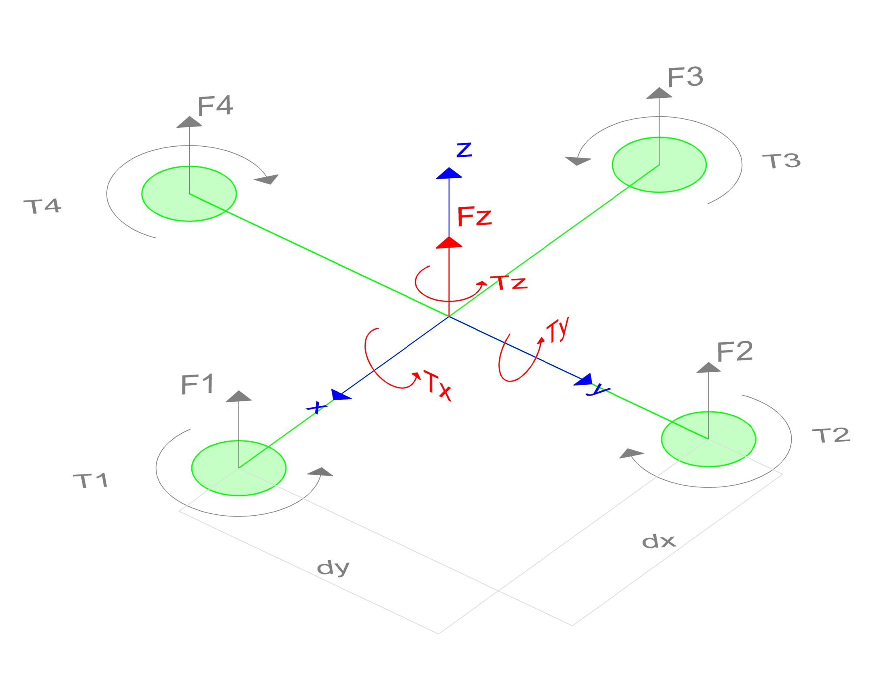
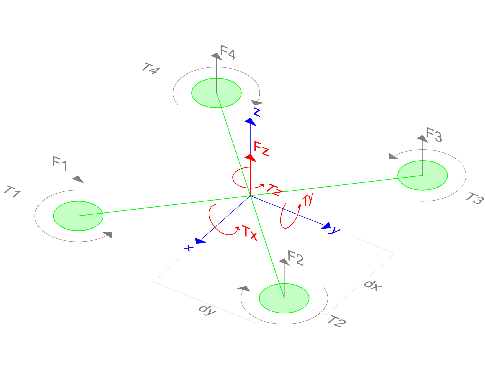
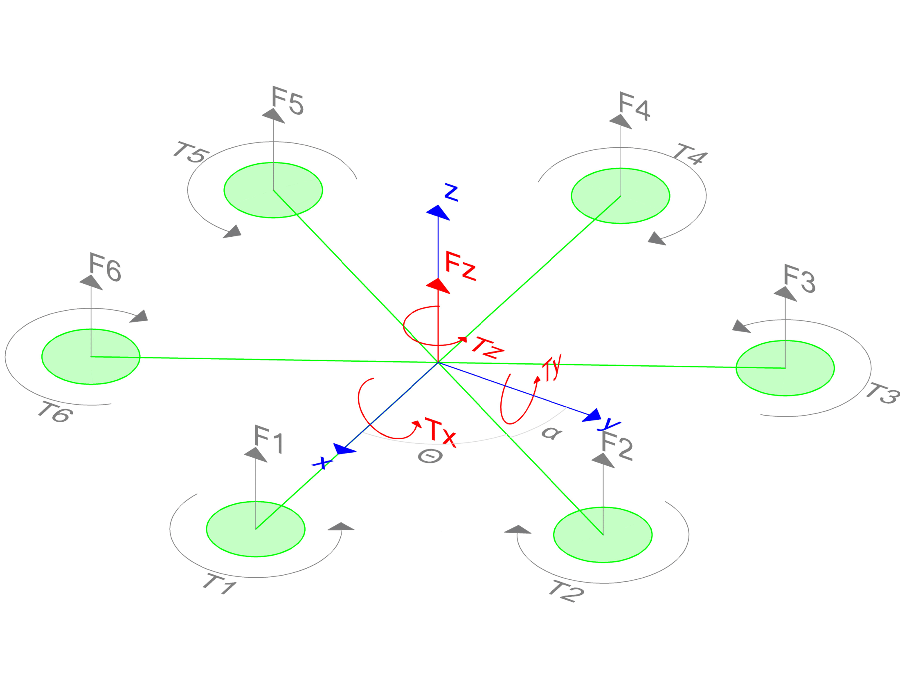

# Multirotor Dynamics of Common Configurations

As exposed in [dynamics section](Dynamics.md), the sum of all forces and torques acting on the rigid body when the motors are aligned with the body frame are:

```math
\begin{bmatrix}
F_z \\
\tau_x \\
\tau_y \\
\tau_z
\end{bmatrix}
=
\sum_{i=1}^n
\begin{bmatrix}
k_{f} \\
T_{y_{BM}} \cdot k_{f} \\
T_{x_{BM}} \cdot k_{f} \\
k_{t}
\end{bmatrix}_i
\cdot
\begin{bmatrix}
w²
\end{bmatrix}_i
+
\begin{bmatrix}
0 \\
0 \\
0 \\
J_{motor}
\end{bmatrix}_i
\cdot
\begin{bmatrix}
\alpha
\end{bmatrix}_i
```

These matrix that relate the forces and torques with the angular and linear accelerations are related with the mixer matrix. In this section, these matrix are exposed for the most common multirotor configurations.

<span style="font-size: 20px;">Multirotor Dynamics Table of Contents </span>
- [Quadrotor + Configuration](#quadrotor--configuration)
- [Quadrotor X Configuration](#quadrotor-x-configuration)
- [Hexarotor Configuration](#hexarotor-configuration)


## Quadrotor + Configuration
Quadrotors have four motors aligned with the body frame. Its schematic representation with plus configuration is

<div style="text-align:center">

</div>

Where each motor rotates in the direction of the arrow. Asuming that are motors are identical, the resulting matrix is:

```math
\begin{bmatrix}
F_z \\
\tau_x \\
\tau_y \\
\tau_z
\end{bmatrix}
=
\begin{bmatrix}
k_{f} & k_{f} & k_{f} & k_{f} \\
0 & d_y \cdot k_{f} & 0 & -d_y \cdot k_{f} \\
-d_x \cdot k_{f} & 0 & d_x \cdot k_{f} & 0 \\
k_{t} & -k_{t} & k_{t} & -k_{t}
\end{bmatrix}
\cdot
\begin{bmatrix}
w_{1}² \\
w_{2}² \\
w_{3}² \\
w_{4}²
\end{bmatrix}
+
\begin{bmatrix}
0 & 0 & 0 & 0 \\
0 & 0 & 0 & 0 \\
0 & 0 & 0 & 0 \\
J & -J & J & -J
\end{bmatrix}
\cdot
\begin{bmatrix}
\alpha_{1} \\
\alpha_{2} \\
\alpha_{3} \\
\alpha_{4}
\end{bmatrix}
```

## Quadrotor X Configuration

Quadrotors have four motors aligned with the body frame. Its schematic representation with cross configuration is:

<div style="text-align:center">

</div>

Where each motor rotates in the direction of the arrow. Asuming that are motors are identical, the resulting matrix is:

```math
\begin{bmatrix}
F_z \\
\tau_x \\
\tau_y \\
\tau_z
\end{bmatrix}
=
\begin{bmatrix}
k_{f} & k_{f} & k_{f} & k_{f} \\
-d_y \cdot k_{f} & d_y \cdot k_{f} & d_y \cdot k_{f} & -d_y \cdot k_{f} \\
-d_x \cdot k_{f} & -d_x \cdot k_{f} & d_x \cdot k_{f} & d_x \cdot k_{f} \\
k_{t} & -k_{t} & k_{t} & -k_{t}
\end{bmatrix}
\cdot
\begin{bmatrix}
w_{1}² \\
w_{2}² \\
w_{3}² \\
w_{4}²
\end{bmatrix}
+
\begin{bmatrix}
0 & 0 & 0 & 0 \\
0 & 0 & 0 & 0 \\
0 & 0 & 0 & 0 \\
J & -J & J & -J
\end{bmatrix}
\cdot
\begin{bmatrix}
\alpha_{1} \\
\alpha_{2} \\
\alpha_{3} \\
\alpha_{4}
\end{bmatrix}
```

## Hexarotor Configuration

Hexarotors have six motors aligned with the body frame. Its schematic representation is:

<div style="text-align:center">

</div>

Where each motor rotates in the direction of the arrow. The angles $\theta$ and $\alpha$ are complementary, been $\theta=\frac{\pi}{3}=60º$ and $\alpha=\frac{\pi}{6}=30º$. Asuming that are motors are identical, the resulting matrix is:

```math
\begin{bmatrix}
F_z \\
\tau_x \\
\tau_y \\
\tau_z
\end{bmatrix}
=
\begin{bmatrix}
k_{f} & k_{f} & k_{f} & k_{f} & k_{f} & k_{f} \\
-r \cdot k_{f} & -c_{\theta} \cdot r \cdot k_{f} & 0 & c_{\theta} \cdot r \cdot k_{f} & r \cdot k_{f} & c_{\theta} \cdot r \cdot k_{f} \\
0 & s_{\theta} \cdot r \cdot k_{f} & s_{\theta} \cdot r \cdot k_{f} & 0 & -s_{\theta} \cdot r \cdot k_{f} & -s_{\theta} \cdot r \cdot k_{f} \\
k_{t} & -k_{t} & k_{t} & -k_{t} & k_{t} & -k_{t}
\end{bmatrix}
\cdot
\begin{bmatrix}
w_{1}² \\
w_{2}² \\
w_{3}² \\
w_{4}² \\
w_{5}² \\
w_{6}²
\end{bmatrix}
+
\begin{bmatrix}
0 & 0 & 0 & 0 & 0 & 0 \\
0 & 0 & 0 & 0 & 0 & 0 \\
0 & 0 & 0 & 0 & 0 & 0 \\
J & -J & J & -J & J & -J
\end{bmatrix}
\cdot
\begin{bmatrix}
\alpha_{1} \\
\alpha_{2} \\
\alpha_{3} \\
\alpha_{4} \\
\alpha_{5} \\
\alpha_{6}
\end{bmatrix}
```

Been $c_{\theta}=\cos(\theta)$ and $s_{\theta}=\sin(\theta)$. Replacing the values of $\theta$ and $\alpha$:

```math
\begin{bmatrix}
F_z \\
\tau_x \\
\tau_y \\
\tau_z
\end{bmatrix}
=
\begin{bmatrix}
k_{f} & k_{f} & k_{f} & k_{f} & k_{f} & k_{f} \\
-r \cdot k_{f} & -\frac{1}{2} \cdot r \cdot k_{f} & 0 & \frac{1}{2} \cdot r \cdot k_{f} & r \cdot k_{f} & \frac{1}{2} \cdot r \cdot k_{f} \\
0 & \frac{\sqrt{3}}{2} \cdot r \cdot k_{f} & \frac{\sqrt{3}}{2} \cdot r \cdot k_{f} & 0 & -\frac{\sqrt{3}}{2} \cdot r \cdot k_{f} & -\frac{\sqrt{3}}{2} \cdot r \cdot k_{f} \\
k_{t} & -k_{t} & k_{t} & -k_{t} & k_{t} & -k_{t}
\end{bmatrix}
\cdot
\begin{bmatrix}
w_{1}² \\
w_{2}² \\
w_{3}² \\
w_{4}² \\
w_{5}² \\
w_{6}²
\end{bmatrix}
+
\begin{bmatrix}
0 & 0 & 0 & 0 & 0 & 0 \\
0 & 0 & 0 & 0 & 0 & 0 \\
0 & 0 & 0 & 0 & 0 & 0 \\
J & -J & J & -J & J & -J
\end{bmatrix}
\cdot
\begin{bmatrix}
\alpha_{1} \\
\alpha_{2} \\
\alpha_{3} \\
\alpha_{4} \\
\alpha_{5} \\
\alpha_{6}
\end{bmatrix}
```
