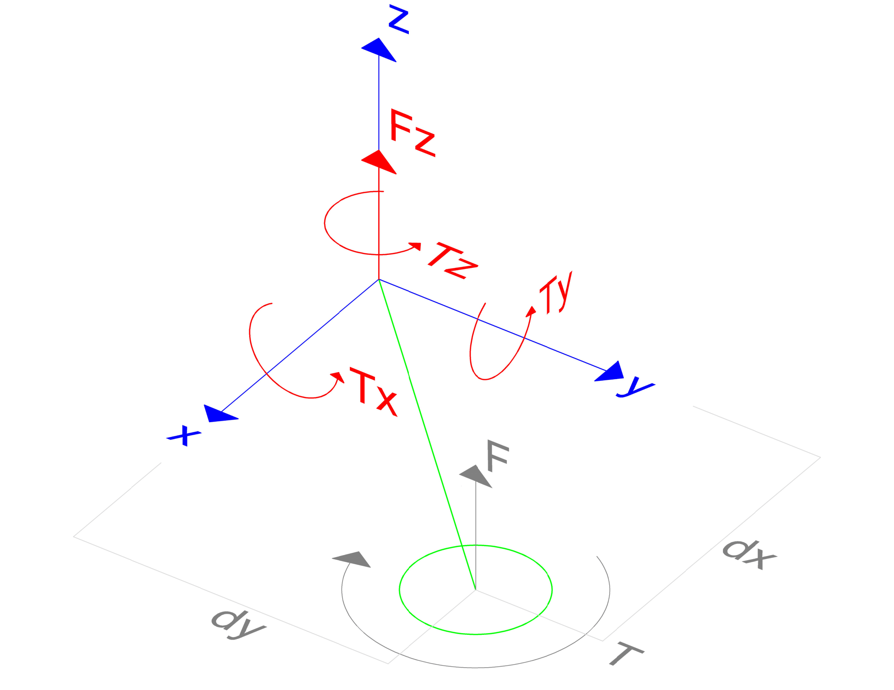

# Multirotor Dynamics

The multirotor change it [state](State.md) due to the forces and torques applied to it. They are produced by the motors, the environment and the multirotor itself.

<span style="font-size: 20px;">Multirotor Dynamics Table of Contents </span>

- [**1. Forces and Torque due to Motors in Motor Frame**](#1-forces-and-torque-due-to-motors-in-motor-frame)
- [**2. Forces and Torques due to Motors in Body Frame**](#2-forces-and-torques-due-to-motors-in-body-frame)
  - [**2.1 Forces**](#21-forces)
    - [**Summary of Forces**](#summary-of-forces)
  - [**2.2 Torques**](#22-torques)
    - [**2.2.1 Torque due to Thrust Force**](#221-torque-due-to-thrust-force)
    - [**2.2.2 Torque due to Motor Rotation**](#222-torque-due-to-motor-rotation)
      - [**2.2.2.1 Torque due to Motor Propellers**](#2221-torque-due-to-motor-propellers)
      - [**2.2.2.2 Torque due to Motor Inertia**](#2222-torque-due-to-motor-inertia)
    - [**Summary of Torques**](#summary-of-torques)
  - [**2.3 Summary of Forces and Torques due to Motors in Body Frame**](#23-summary-of-forces-and-torques-due-to-motors-in-body-frame)
- [**3. Forces and Torques due to Environment**](#3-forces-and-torques-due-to-environment)
  - [**3.1 Forces due to Environment in World Frame**](#31-forces-due-to-environment-in-world-frame)
    - [**3.1.1 Gravity Force**](#311-gravity-force)
    - [**3.1.2 Aerodynamic Drag**](#312-aerodynamic-drag)
    - [**3.1.3 Stochastic Force**](#313-stochastic-force)
  - [**3.2 Torques due to Environment in Body Frame**](#32-torques-due-to-environment-in-body-frame)
    - [**3.2.1 Aerodynamic Drag**](#321-aerodynamic-drag)
    - [**3.2.2 Stochastic Torque**](#322-stochastic-torque)


## **1. Forces and Torque due to Motors in Motor Frame**

Each motor produces a force in its z-axis and a torque in the x and y axes, as shown in the figure below.

<div style="text-align:center">

</div>

The force produced by the motor can be describe as a function of the angular velocity of the motor and the thrust coefficient $k_f$:

```math
F_m = k_f \cdot \omega^2
```

And the torque produced by the motor can be describe as a function of the angular velocity of the motor and the torque coefficient $k_t$:

```math
\tau_m = k_t \cdot \omega^2
```

## **2. Forces and Torques due to Motors in Body Frame**

Each force produced by the motor is transformed to the body frame by the rotation matrix $R_{BM}$ and the translation matrix $T_{BM}$.

### **2.1 Forces**

The force applied to the rigid body is the sum of the forces produced by each motor:

```math
\vec{F} = \sum_{i=1}^n \vec{F}_i
```

As mention before, the force produced by the $i$-th motor in motor frame is given by:

```math
\vec{F}_{i_M} = \vec{Z}(F_{i_M}) = \vec{Z}(k_{f_i} \cdot \omega_{i}^2)
```

where:
- $\vec{Z}(F_{i_M})$ is the force produced by the $i$-th motor in the z-axis of the motor frame.

To transform the force produced by the motor to the body frame, the rotation matrix $R_{BM}$ is used:

```math
\vec{F}_{i_B} = R_{BM_i} \cdot \vec{F}_{i_M}
```

where:
- $R_{BM_i}$ is the rotation matrix from the $i$-th motor to the body frame.
- $\vec{F}_{i_M}$ is the force produced by the $i$-th motor in motor frame.

#### **Summary of Forces**

In resumen, the total force produced motors in body frame is given by:

```math
\vec{F}_B = \sum_{i=1}^n R_{BM_i} \cdot \vec{Z}(k_{f_i} \cdot \omega_{i}^2)
```

If motors are aligned with the body frame, rotation matrix $R_{BM_i}$ is the identity matrix, resulting in:

```math
\vec{F}_{B} = \sum_{i=1}^n \vec{Z}(k_{f_i} \cdot \omega_{i}^2)
```

As the force is only applied in the z-axis of the motor frame, also is only applied in the z-axis of the body frame. This results in:

```math
\begin{bmatrix}
F_x \\
F_y \\
F_z
\end{bmatrix}
=
\sum_{i=1}^n
\begin{bmatrix}
0 \\
0 \\
k_{f} \cdot \omega^2 
\end{bmatrix}_i
```

This matrix is related with the mixer matrix.

### **2.2 Torques**

The torque applied to the rigid body is the sum of the torques produced by each motor:

```math
\vec{\tau}_B = \sum_{i=1}^n \vec{\tau_i}
```

It is composed of two parts, one due to the thrust force in motor frame and another due to the torque produced by the motor spinning.

```math
\vec{\tau}_B = \vec{\tau}_{thrust_B} + \vec{\tau}_{torque_B} = \sum_{i=1}^n \vec{\tau}_{i,thrust_B} + \sum_{i=1}^n \vec{\tau}_{i,torque_B}
```

Where:
- $\vec{\tau}_{i,thrust_B}$ is the torque produced by the thrust force of the $i$-th motor in body frame.
- $\vec{\tau}_{i,torque_B}$ is the torque produced by the torque of the $i$-th motor in body frame.

#### **2.2.1 Torque due to Thrust Force**

The torque produced to the rigid body by the thrust force is given by the cross product between the translation of the motor and the thrust force:

```math
\vec{\tau}_{thrust_B} = \sum_{i=1}^n \vec{\tau}_{i,thrust_B}  = \sum_{i=1}^n T_{BM_i} \cdot \vec{F}_{i_B}
```

Where:
- $T_{BM_i}$ is the translation matrix from the $i$-th motor to the body frame.
- $\vec{F}_i$ is the thrust force of the $i$-th motor in body frame.

Replacing the thrust force in body frame to the thrust force in motor frame:

```math
\vec{\tau}_{thrust_B} = \sum_{i=1}^n T_{BM_i} \cdot R_{BM_i} \cdot \vec{Z}(k_{f_i} \cdot \omega_{m_i}^2)
```

#### **2.2.2 Torque due to Motor Rotation**

Motor rotation generates a torque in the body frame. This torque is produced by the rotation of the motor with the propellers and its inertia.

```math
\vec{\tau}_{torque_B} = \vec{\tau}_{propellers_B} + \vec{\tau}_{inertia_B}
```

Where:
- $\vec{\tau}_{propellers_B}$ is the torque produced by motors rotation with propellers in body frame.
- $\vec{\tau}_{inertia_B}$ is the torque produced by the inertia of motors in body frame.

##### **2.2.2.1 Torque due to Motor Propellers**

As mention before, the torque produced by the motor rotation with propellers in motor frame is given by the motor torque coefficient. This torque is produced in the z-axis of the motor frame.

```math
\vec{\tau}_{i,propellers_M} = \vec{Z}(k_{t_i} \cdot \omega_i^2)
```

To transform it to the body frame, the rotation matrix $R_{BM}$ is used:

```math
\vec{\tau}_{i,propellers_B} = R_{BM_i} \cdot \vec{\tau}_{i,propellers_M}
```

In resumen, the torque produced by motors rotation with propellers in body frame is given by:

```math
\vec{\tau}_{propellers_B} = \sum_{i=1}^n R_{BM_i} \cdot \vec{Z}(k_{t_i} \cdot \omega_i^2)
```

##### **2.2.2.2 Torque due to Motor Inertia**

The torque produced by the inertia of the motor in motor frame is given by the product of the motor rotational inertia and the angular acceleration of the motor. This torque is produced in the z-axis of the motor frame.

```math
\vec{\tau}_{i,inertia_M} = \vec{Z}(J_{i,motor} \cdot \alpha_i)
```

Where:
- $J_{i,motor}$ is the rotational inertia of the motor in motor frame.
- $\alpha_i$ is the angular acceleration of the motor in motor frame.

To transform it to the body frame, the rotation matrix $R_{BM}$ is used:

```math
\vec{\tau}_{i,inertia_B} = R_{BM_i} \cdot \vec{\tau}_{i,inertia_M}
```

In resumen, the torque produced by motors inertia in body frame is given by:

```math
\vec{\tau}_{inertia_B} = \sum_{i=1}^n R_{BM_i} \cdot \vec{Z}(J_{i,motor} \cdot \alpha_i)
```

#### **Summary of Torques**

In resumen, the torque produced by each motor torque in body frame is given by the sum of the torque produced by the thrust force and the torque produced by the motor rotation and inertia:

```math
\vec{\tau}_B = \vec{\tau}_{thrust_B} + \vec{\tau}_{torque_B}
```
```math
\vec{\tau}_B = \vec{\tau}_{thrust_B} + \vec{\tau}_{propellers_B} + \vec{\tau}_{inertia_B}
```
```math
\vec{\tau}_B = \sum_{i=1}^n T_{BM_i} \cdot R_{BM_i} \cdot \vec{Z}(k_{f_i} \cdot \omega_{i}^2) + \sum_{i=1}^n R_{BM_i} \cdot \vec{Z}(k_{t_i} \cdot \omega_i^2) + \sum_{i=1}^n R_{BM_i} \cdot \vec{Z}(J_{i,motor} \cdot \alpha_{i})
```
```math
\vec{\tau}_B = \sum_{i=1}^n [T_{BM_i} \cdot R_{BM_i} \cdot \vec{Z}(k_{f_i} \cdot \omega_{i}^2) + R_{BM_i} \cdot \vec{Z}(k_{t_i} \cdot \omega_i^2) + R_{BM_i} \cdot \vec{Z}(J_{i,motor} \cdot \alpha_{i})]
```

Note that when the motors are align with the body frame, the rotation matrix $R_{BM_i}$ is the identity matrix, resulting in:

```math
\vec{\tau}_B = \sum_{i=1}^n [T_{BM_i} \cdot \vec{Z}(k_{f_i} \cdot \omega_{i}^2) + \vec{Z}(k_{t_i} \cdot \omega_i^2) + \vec{Z}(J_{i,motor} \cdot \alpha_{i})]
```

Also, the torque produced by the thrust force is applied in x and y axes, while the torque produced by the motor rotation and inertia is applied in z axis. This results in:

```math
\begin{bmatrix}
\tau_x \\
\tau_y \\
\tau_z
\end{bmatrix}
=
\sum_{i=1}^n
\begin{bmatrix}
T_{y_{BM}} \cdot k_{f} \cdot \omega^2 \\
T_{x_{BM}} \cdot k_{f} \cdot \omega^2 \\
k_{t} \cdot \omega^2 + J_{motor} \cdot \alpha
\end{bmatrix}_i
```

### **2.3 Summary of Forces and Torques due to Motors in Body Frame**

In resumen, the forces and torques produced by the motors in body frame are given by:

```math
\vec{F}_B = \sum_{i=1}^n R_{BM_i} \cdot \vec{Z}(k_{f_i} \cdot \omega_{i}^2)
```
```math
\vec{\tau}_B = \sum_{i=1}^n [T_{BM_i} \cdot R_{BM_i} \cdot \vec{Z}(k_{f_i} \cdot \omega_{i}^2) + R_{BM_i} \cdot \vec{Z}(k_{t_i} \cdot \omega_i^2) + R_{BM_i} \cdot \vec{Z}(J_{i,motor} \cdot \alpha_{i})]
```

When the motors are align with the body frame, the resulting forces and torques are:

```math
\begin{bmatrix}
F_x \\
F_y \\
F_z \\
\tau_x \\
\tau_y \\
\tau_z
\end{bmatrix}
=
\sum_{i=1}^n
\begin{bmatrix}
0 \\
0 \\
k_{f} \cdot \omega^2 \\
T_{y_{BM}} \cdot k_{f} \cdot \omega^2 \\
T_{x_{BM}} \cdot k_{f} \cdot \omega^2 \\
k_{t} \cdot \omega^2 + J_{motor} \cdot \alpha
\end{bmatrix}_i
```

This can be factorized as:

```math
\begin{bmatrix}
F_z \\
\tau_x \\
\tau_y \\
\tau_z
\end{bmatrix}
=
\sum_{i=1}^n
\begin{bmatrix}
k_{f} \\
T_{y_{BM}} \cdot k_{f} \\
T_{x_{BM}} \cdot k_{f} \\
k_{t}
\end{bmatrix}_i
\cdot
\begin{bmatrix}
w²
\end{bmatrix}_i
+
\begin{bmatrix}
0 \\
0 \\
0 \\
J_{motor}
\end{bmatrix}_i
\cdot
\begin{bmatrix}
\alpha
\end{bmatrix}_i

```

This matrix is related with the mixer matrix.

Some of the most common configurations can be found in [Common Configurations](CommonConfigurations.md).

## **3. Forces and Torques due to Environment**

Environment forces and torques are produced by external factors, such as wind, gravity, and air resistance.

### **3.1 Forces due to Environment in World Frame**

The forces can be simplified as the sum of the gravity force, the aerodynamic drag and a stochastic force.

```math
\vec{F}_W = \vec{F}_{g_W} + \vec{F}_{drag_W} + \vec{F}_{stochastic_W}
```

#### **3.1.1 Gravity Force**

The gravity force is produced by the gravity acceleration. The gravity force in the world frame is given by:

```math
\vec{F}_{g_W} = \vec{Z}(m \cdot g)
```

where:
- $m$ is the multirotor mass.
- $g$ is the gravity acceleration.

#### **3.1.2 Aerodynamic Drag**

The drag force is produced by the air resistance to the multirotor's motion. The magnitude of the drag force can be linearized as proportional to the square of the vehicle's lineal velocity and to a coefficient of drag that depends on the shape and size of the vehicle, as well as the properties of the fluid through which the vehicle is moving. The mathematical model of the drag force can be expressed as:

```math
\vec{F}_{drag_B} = - \frac{1}{2} \cdot \rho \cdot A \cdot C_D \cdot \vec{v}_{B}^2
```

where:
- $\vec{F}_{drag_W}$ is the drag force in the body frame.
- $\rho$ is the density of the fluid.
- $A$ is the cross-sectional area of the vehicle.
- $C_D$ is the drag coefficient of the vehicle.
- $\vec{v}_{B}$ is the lineal velocity of the vehicle in the body frame.

Simplified, the drag force can be expressed as:

```math
\vec{F}_{drag_B} = - k_{drag} \cdot \vec{v}_{B}^2
```

where:
- $k_{drag}$ is the drag coefficient.

The negative sign in front of the equation indicates that the aerodynamic force always opposes the multirotor's motion.

To transform the drag force to the world frame, the rotation matrix $R_{WB}$ is used:

```math
\vec{F}_{drag_W} = R_{WB} \cdot \vec{F}_{drag_B}
```

#### **3.1.3 Stochastic Force**

Stochastic forces are produced by the forces that act on the vehicle and are not expected. This can be modeled as a random force with a normal distribution.

```math
\vec{F}_{stochastic_W} = \vec{N}(0, \sigma^2)
```

where:
- $\vec{F}_{stochastic_W}$ is the stochastic force in the world frame.
- $\sigma$ is the standard deviation of the stochastic force.

### **3.2 Torques due to Environment in Body Frame**

The torques can be simplified as the sum of the aerodynamic torque and a stochastic torque.

```math
\vec{\tau}_B = \vec{\tau}_{aero_B} + \vec{\tau}_{stochastic_B}
```

#### **3.2.1 Aerodynamic Drag**

The aerodynamic torque is produced by the air resistance to the multirotor's motion, and it depends on the multirotor's shape, size, and orientation. The aerodynamic torque can be calculated by:

```math
\vec{\tau}_B = -\vec{\omega} \times (I_{aero} \cdot \vec{\omega})
```

Where:
- $\vec{\tau}_B$ is the aerodynamic torque in the body frame
- $I_{aero}$ is the aerodynamic inertia matrix
- $\vec{\omega}$ is the angular velocity of the multirotor in the body frame

The negative sign in front of the equation indicates that the aerodynamic torque always opposes the multirotor's motion.

#### **3.2.2 Stochastic Torque**

Stochastic torques are produced by the forces that act on the vehicle and are not expected. It can be modeled as a random torque with a normal distribution.

```math
\vec{\tau}_{stochastic_B} = \vec{N}(0, \sigma^2)
```

where:
- $\vec{\tau}_{stochastic_B}$ is the stochastic torque in the body frame.
- $\sigma$ is the standard deviation of the stochastic torque.

